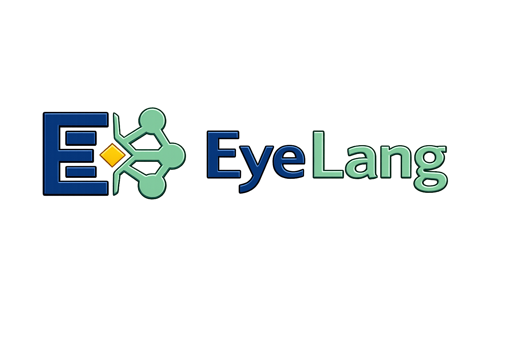

# Eyelang

<p align="center">
  
</p>

[](https://www.npmjs.com/package/eyelang)
[](https://doi.org/10.5281/zenodo.21446308)

Eyelang combines ISO Prolog and W3C RDF 1.2 to produce answers with
inspectable proofs.

**[Book — *The Art of Eyelang*](https://eyereasoner.github.io/eyelang/the-art-of-eyelang)** ·
**[Why Eyelang?](https://eyereasoner.github.io/eyelang/why-eyelang)** ·
**[Playground](https://eyereasoner.github.io/eyelang/playground)**

The book is the reference for the language, command line, JavaScript API,
RDF 1.2 support, examples, proofs, conformance, and implementation.

## Quick start

Eyelang requires Node.js 18 or newer.

```sh
npm install --global eyelang
eyelang examples/socrates.pl
eyelang --proof examples/socrates.pl
eyelang --goal 'type(socrates, mortal)' examples/socrates.pl
```

Programs may declare their default queries with `%% goal:` comments.

## RDF 1.2

```sh
node tools/rdf-to-pl.mjs --rules rules.pl data.ttl -o program.pl
eyelang program.pl > derived.pl
node tools/pl-to-rdf.mjs derived.pl -o derived.nq
```

See the book for RDF mappings, graphs, triple terms, reifiers, annotations,
formats, and policy examples.

## Development

```sh
git clone https://github.com/eyereasoner/eyelang.git
cd eyelang
npm install
npm test
```

Eyelang is released under the [MIT License](LICENSE.md).
